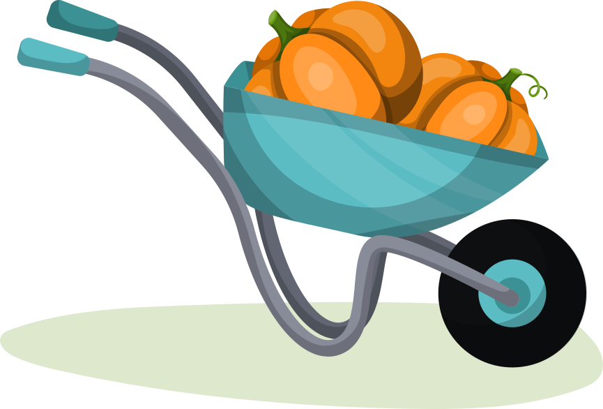

[](https://github.com/johnwalley/allotment/actions/workflows/build.yml)
[](https://github.com/johnwalley/allotment/blob/main/LICENSE)
[](https://npmjs.com/package/allotment/)
[](https://allotment-storybook.netlify.app/)

<p align="center">
    <a href="https://github.com/johnwalley/allotment">
    
  </a>
  
  <h3 align="center">Allotment</h3>

  <p align="center">
    React split-pane component.
  </p>
  
  <p align="center">
    
  </p>
</p>

- **React-based:** Integrate effortlessly into your existing React-based application.
- **Industry standard look and feel:** Like VS Code's split view implementation? You're in luck! This component is derived from the same codebase.
- **Dynamic:** Want to declaratively add and remove panes? We've got you covered.

## Examples

You can find examples of using the library [here](https://allotment-storybook.netlify.app/).

## Getting Started

Allotment is available from npm.

### Prerequisites

Allotment has `react` and `react-dom` as peer dependencies.

```sh
yarn add react react-dom
```

### Installation

```sh
yarn add allotment
```

## Usage

```jsx
import React from "react";
import { Allotment } from "allotment";
import "allotment/dist/style.css";

export const App = () => (
  <Allotment>
    <ComponentA>
    <ComponentB>
  </Allotment>
);
```

If you want more control over the behaviour of the individual panes you can use the `Allotment.Pane` component. This includes setting the minimum and maximum size of a pane, as well as whether to enable snapping behaviour.

```jsx
<Allotment>
  <Allotment.Pane minSize={200}>
    <ComponentA>
  </Allotment.Pane>
  <Allotment.Pane snap>
    <ComponentB>
  </Allotment.Pane>
</Allotment>
```

## Allotment props

All properties are optional.

### defaultSizes

An array of initial sizes of the panes. If the sum of the sizes differs from the size of the container then the panes' sizes will be scaled proportionally.

```jsx
<Allotment defaultSizes={[100, 200]}>
  <div />
  <div />
</Allotment>
```

### maxSize (default: `Infinity`)

Maximum size of any pane.

### minSize (default: `30`)

Minimum size of any pane.

### proportionalLayout (default: `true`)

Resize each view proportionally when resizing container.

### separator (default: `true`)

Whether to render a separator between panes.

### snap (default: `false`)

Enable snap to zero for all panes.

### vertical (default: `false`)

Direction to split. If true then the panes will be stacked vertically, otherwise they will be stacked horizontally.

### onChange

Callback that is fired when the pane sizes change (usually on drag). Recommended to add a debounce function to rate limit the callback. Passed an array of numbers.

### onReset

Callback that is fired whenever the user double clicks a sash.

### onVisibleChange

Callback that is fired whenever the user changes the visibility of a pane by snapping. Note that this will only be called if the new value is different from the current `visible` prop on the Pane.

## Allotment.Pane props

### maxSize

Maximum size of this pane. Overrides `maxSize` set on parent component.

### minSize

Minimum size of this pane. Overrides `minSize` set on parent component.

### priority

The priority of the pane when the layout algorithm runs. Panes with higher priority will be resized first.

Only used when `proportionalLayout` is false.

### preferredSize

Preferred size of this pane. Allotment will attempt to use this size when adding this pane (including on initial mount) as well as when a user double clicks a sash, or the `reset` method is called on the Allotment instance.

The size can either be a number or a string. If it is a number it will be interpreted as a number of pixels. If it is a string it should end in either "px" or "%". If it ends in "px" it will be interpreted as a number of pixels, e.g. "120px". If it ends in "%" it will be interpreted as a percentage of the size of the Allotment component, e.g. "50%".

### snap

Enable snap to zero for this pane. Overrides `snap` set on parent component.

### visible

Whether the pane should be visible.

## Styling

Allotment uses [CSS variables](https://developer.mozilla.org/en-US/docs/Web/CSS/Using_CSS_custom_properties) for styling.
You can customize the following default variables.

```css
:root {
  --focus-border: #007fd4;
  --separator-border: #838383;
}
```

To control the feedback area size of the dragging area between panes you can call the exported `setSashSize` function with desired size in pixels. Set it to a larger value if you feel it's hard to resize the panes using the mouse. On touch devices the feedback area is always set to 20 pixels

### Programmatic control

You can use a ref to get access to the Allotment component instance and call its reset and resize methods manually:

```jsx
const ref = React.useRef(ref);

return (
  <div>
    <button
      onClick={() => {
        ref.current.reset();
      }}
    >
      Reset
    </button>
    <button
      onClick={() => {
        ref.current.resize([100, 200]);
      }}
    >
      Resize
    </button>
    <Allotment ref={ref}>
      <div />
      <div />
    </Allotment>
  </div>
);
```

## Frequently asked questions

### It's not working/I don't see anything

The Allotment component takes its width and height from the element which contains it. It does not come with an explicit width or height out of the box. It's easy to end up with a div of height zero by accident. For example, adding allotment to a brand new Create React App project without setting a height on a containing div won't work because the default root div itself has no height.

You should also check that the css has been imported/included, for example at the root of your application:

```jsx
import "allotment/dist/style.css";
```

### My content is larger than the containing pane. How can I let the user scroll?

The simplest approach is to place your content inside a new div with width and height `100%` and overflow `auto`. This div will have the same dimensions as the pane it's inside and if its content overflows the browser will provide scrolling behaviour.

### Next.js

If you get an error when importing allotment in a Next.js project consider [not including the module server-side](https://nextjs.org/docs/advanced-features/dynamic-import#with-no-ssr). Allotment currently only works in a browser. It might be possible to produce sensible results server-side in the future so create an issue requesting this if interested.

### How do I prevent a pane from being resized?

Set `minSize` and `maxSize` props to the same value.

### How do I style the component?

Some common style changes can be made by setting CSS variables.

These include:

| Name                 | Default                     | Description                    |
| :------------------- | :-------------------------- | :----------------------------- |
| `--focus-border`     | `#007fd4`                   | Color of the sash when hovered |
| `--separator-border` | `rgba(128, 128, 128, 0.35)` | Color of the separator         |

For more involved styling you can target the component's child elements.

| Class                          | Description                                                     |
| :----------------------------- | :-------------------------------------------------------------- |
| `.split-view`                  | Styles applied to the top-level container                       |
| `.split-view-horizontal`       | Styles applied to the top-level container if `vertical={false}` |
| `.split-view-vertical`         | Styles applied to the top-level container if `vertical={true}`  |
| `.split-view-separator-border` | Styles applied to the top-level container if `separator={true}` |
| `.split-view-sash-dragging`    | Styles applied to the top-level container if sash is dragging   |
| `.sash-container`              | Styles applied to the sash container                            |
| `.sash`                        | Styles applied to the sash                                      |
| `.sash-active`                 | Styles applied to the sash if being dragged                     |
| `.sash-disabled`               | Styles applied to the sash if disabled                          |
| `.sash-horizontal`             | Styles applied to the sash if `vertical={false}`                |
| `.sash-hover`                  | Styles applied to the sash if being hovered over                |
| `.sash-mac`                    | Styles applied to the sash if running under macos               |
| `.sash-maximum`                | Styles applied to the sash if the pane is maximised             |
| `.sash-minimum`                | Styles applied to the sash if the pane is minimised             |
| `.sash-vertical`               | Styles applied to the sash if `vertical={true}`                 |
| `.split-view-container`        | Styles applied to the split view container                      |
| `.split-view-view`             | Styles applied to the split view view                           |
| `.split-view-view-visible`     | Styles applied to the split view view if `visible={true}`       |
