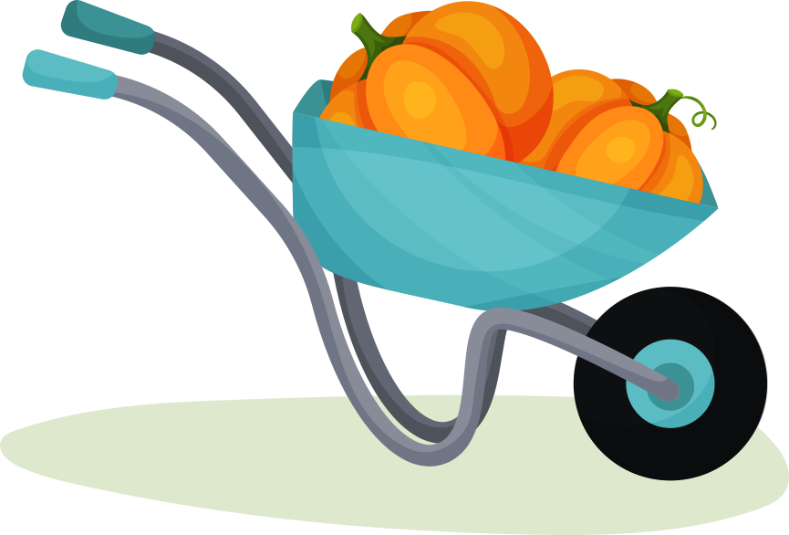

[](https://github.com/johnwalley/allotment/actions/workflows/build.yml)
[](https://www.npmjs.com/package/allotment)
[](https://www.npmjs.com/package/allotment)
[](https://bundlephobia.com/package/allotment)
[](https://www.npmjs.com/package/allotment)
[](https://github.com/johnwalley/allotment/blob/main/LICENSE)
[](https://allotment-storybook.netlify.app/)

<p align="center">
    <a href="https://github.com/johnwalley/allotment">
    
  </a>
  
  <h3 align="center">Allotment</h3>

  <p align="center">
    React split-pane component.
  </p>

  <p align="center">
    <a href="https://allotment.mulberryhousesoftware.com/">Docs</a>
    ·
    <a href="https://allotment-storybook.netlify.app/">Examples</a>
    ·
    <a href="./CHANGELOG.md">Changelog</a>
  </p>
  
  <p align="center">
    
  </p>
</p>

- **React-based:** Integrate effortlessly into your existing React-based application.
- **Industry standard look and feel:** Like VS Code's split view implementation? You're in luck! This component is derived from the same codebase.
- **Dynamic:** Want to declaratively add and remove panes? We've got you covered.

## Quick start

```sh
npm install allotment
```

Allotment requires React 17, 18 or 19 (`react` and `react-dom` are peer dependencies).

```jsx
import { Allotment } from "allotment";
import "allotment/dist/style.css";

export const App = () => (
  <div style={{ height: 400 }}>
    <Allotment>
      <div>Pane A</div>
      <div>Pane B</div>
    </Allotment>
  </div>
);
```

Allotment fills its parent element, so make sure the parent has a height. See the [FAQ](#its-not-workingi-dont-see-anything) if nothing is showing.

## API

The tables below summarise the API. See the [documentation](https://allotment.mulberryhousesoftware.com/) for more detail and live examples.

### `Allotment`

All props except `children` are optional.

| Prop                 | Type                                        | Default    | Description                                                                                                                               |
| -------------------- | ------------------------------------------- | ---------- | ----------------------------------------------------------------------------------------------------------------------------------------- |
| `className`          | `string`                                    |            | Class name for the outer element.                                                                                                         |
| `defaultSizes`       | `number[]`                                  |            | Initial pane sizes. Scaled proportionally if they don't add up to the container size.                                                     |
| `id`                 | `string`                                    |            | Id for the outer element.                                                                                                                 |
| `maxSize`            | `number`                                    | `Infinity` | Maximum size of any pane.                                                                                                                 |
| `minSize`            | `number`                                    | `30`       | Minimum size of any pane.                                                                                                                 |
| `proportionalLayout` | `boolean`                                   | `true`     | Resize panes proportionally when the container is resized.                                                                                |
| `separator`          | `boolean`                                   | `true`     | Render a separator between panes.                                                                                                         |
| `snap`               | `boolean`                                   | `false`    | Allow all panes to snap to zero size.                                                                                                     |
| `vertical`           | `boolean`                                   | `false`    | Stack panes vertically instead of horizontally.                                                                                           |
| `onChange`           | `(sizes: number[]) => void`                 |            | Called when pane sizes change, usually while dragging. Consider debouncing it.                                                            |
| `onDragStart`        | `(sizes: number[]) => void`                 |            | Called when the user starts dragging a sash.                                                                                              |
| `onDragEnd`          | `(sizes: number[]) => void`                 |            | Called when the user stops dragging a sash.                                                                                               |
| `onReset`            | `() => void`                                |            | Called when the user double clicks a sash. If provided, it replaces the default reset behaviour.                                          |
| `onVisibleChange`    | `(index: number, visible: boolean) => void` |            | Called when the user snaps a pane open or closed. Only called for panes with a `visible` prop, and only if the new value differs from it. |
| `sizes`              | `number[]`                                  |            | **Deprecated.** Use `defaultSizes` instead.                                                                                               |

### `Allotment.Pane`

Wrap a child in `Allotment.Pane` to configure it individually. `maxSize`, `minSize` and `snap` override the values set on the parent `Allotment`.

| Prop            | Type               | Default                 | Description                                                                                                                                                                      |
| --------------- | ------------------ | ----------------------- | -------------------------------------------------------------------------------------------------------------------------------------------------------------------------------- |
| `className`     | `string`           |                         | Class name for the pane element.                                                                                                                                                 |
| `maxSize`       | `number`           | Inherited               | Maximum size of this pane.                                                                                                                                                       |
| `minSize`       | `number`           | Inherited               | Minimum size of this pane.                                                                                                                                                       |
| `preferredSize` | `number \| string` |                         | Size to use when the pane is added, when a sash is double clicked, and when `reset()` is called. A number or `"120px"` is in pixels; `"50%"` is a percentage of the `Allotment`. |
| `priority`      | `LayoutPriority`   | `LayoutPriority.Normal` | Panes with higher priority are resized first. Only used when `proportionalLayout` is `false`.                                                                                    |
| `snap`          | `boolean`          | Inherited               | Allow this pane to snap to zero size.                                                                                                                                            |
| `visible`       | `boolean`          | `true`                  | Whether the pane is visible.                                                                                                                                                     |

```jsx
import { Allotment, LayoutPriority } from "allotment";

<Allotment proportionalLayout={false}>
  <Allotment.Pane minSize={200} priority={LayoutPriority.High}>
    <ComponentA />
  </Allotment.Pane>
  <Allotment.Pane preferredSize="30%" snap>
    <ComponentB />
  </Allotment.Pane>
</Allotment>;
```

### Ref methods

Pass a ref to `Allotment` to control it from code.

| Method   | Type                        | Description                                                                                                 |
| -------- | --------------------------- | ----------------------------------------------------------------------------------------------------------- |
| `reset`  | `() => void`                | Distribute the panes equally, then apply each pane's `preferredSize`. Calls `onReset` instead, if provided. |
| `resize` | `(sizes: number[]) => void` | Set the pane sizes.                                                                                         |

```tsx
import * as React from "react";
import { Allotment, AllotmentHandle } from "allotment";

function App() {
  const ref = React.useRef<AllotmentHandle>(null);

  return (
    <div>
      <button onClick={() => ref.current?.reset()}>Reset</button>
      <button onClick={() => ref.current?.resize([100, 200])}>Resize</button>
      <Allotment ref={ref}>
        <div />
        <div />
      </Allotment>
    </div>
  );
}
```

## Styling

Allotment uses [CSS variables](https://developer.mozilla.org/en-US/docs/Web/CSS/Using_CSS_custom_properties) for styling. See [How do I style the component?](#how-do-i-style-the-component) for the full list of variables and class names.

```css
:root {
  --focus-border: #007fd4;
  --separator-border: rgba(128, 128, 128, 0.35);
}
```

To control the size of the draggable area between panes you can call the exported `setSashSize` function with the desired size in pixels (clamped between 4 and 20). Set it to a larger value if you find it hard to resize the panes using the mouse. On iOS and iPadOS devices Allotment sets it to 20 pixels.

## Frequently asked questions

### It's not working/I don't see anything

The Allotment component takes its width and height from the element which contains it. It does not come with an explicit width or height out of the box. It's easy to end up with a div of height zero by accident. For example, adding allotment to a brand new Create React App project without setting a height on a containing div won't work because the default root div itself has no height.

You should also check that the css has been imported/included, for example at the root of your application:

```jsx
import "allotment/dist/style.css";
```

### My content is larger than the containing pane. How can I let the user scroll?

The simplest approach is to place your content inside a new div with width and height `100%` and overflow `auto`. This div will have the same dimensions as the pane it's inside and if its content overflows the browser will provide scrolling behaviour.

### Next.js

Allotment currently only works in a browser. When using the App Router, render it from a Client Component (a file starting with `"use client"`). If you still get an error during server rendering, [skip SSR for the component](https://nextjs.org/docs/app/building-your-application/optimizing/lazy-loading#skipping-ssr) with `next/dynamic`:

```jsx
"use client";

import dynamic from "next/dynamic";

const Allotment = dynamic(
  () => import("allotment").then((mod) => mod.Allotment),
  { ssr: false },
);
```

Note that `Allotment.Pane` is not available on a dynamically imported component, so move any code using it into a separate client-only component. It might be possible to produce sensible results server-side in the future so create an issue requesting this if interested.

### How do I prevent a pane from being resized?

Set `minSize` and `maxSize` props to the same value.

### How do I style the component?

Some common style changes can be made by setting CSS variables.

These include:

| Name                               | Default                     | Description                                     |
| :--------------------------------- | :-------------------------- | :---------------------------------------------- |
| `--focus-border`                   | `#007fd4`                   | Color of the sash when hovered                  |
| `--separator-border`               | `rgba(128, 128, 128, 0.35)` | Color of the separator                          |
| `--sash-size`                      | `8px`                       | Size of the draggable area between panes        |
| `--sash-hover-size`                | `4px`                       | Size of the highlighted sash when hovered       |
| `--sash-hover-transition-duration` | `0.1s`                      | Duration of the sash hover highlight transition |

For more involved styling you can target the component's child elements.

| Class                          | Description                                                     |
| :----------------------------- | :-------------------------------------------------------------- |
| `.split-view`                  | Styles applied to the top-level container                       |
| `.split-view-horizontal`       | Styles applied to the top-level container if `vertical={false}` |
| `.split-view-vertical`         | Styles applied to the top-level container if `vertical={true}`  |
| `.split-view-separator-border` | Styles applied to the top-level container if `separator={true}` |
| `.split-view-sash-dragging`    | Styles applied to the top-level container if sash is dragging   |
| `.sash-container`              | Styles applied to the sash container                            |
| `.sash`                        | Styles applied to the sash                                      |
| `.sash-active`                 | Styles applied to the sash if being dragged                     |
| `.sash-disabled`               | Styles applied to the sash if disabled                          |
| `.sash-horizontal`             | Styles applied to the sash if `vertical={false}`                |
| `.sash-hover`                  | Styles applied to the sash if being hovered over                |
| `.sash-mac`                    | Styles applied to the sash if running under macOS               |
| `.sash-maximum`                | Styles applied to the sash if the pane is maximised             |
| `.sash-minimum`                | Styles applied to the sash if the pane is minimised             |
| `.sash-vertical`               | Styles applied to the sash if `vertical={true}`                 |
| `.split-view-container`        | Styles applied to the split view container                      |
| `.split-view-view`             | Styles applied to the split view view                           |
| `.split-view-view-visible`     | Styles applied to the split view view if `visible={true}`       |
